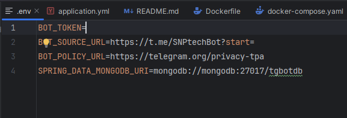

# Telegram-бот - для заполнения Word-документа по шаблону

## Описание проекта
Данный бот позволяет формировать Word-документы(формы) из данных, полученных от пользователей бота. Принцип работы максимально простой:
* пользователь заполняет все данные, в соответсвии с запросами бота
* бот формирует из полученных данных Word-документ
* созданный им документ отсылает пользователю

## Технологический стек проекта
* Java 17
* Spring Boot 3.4.2
* MongoDB
* Spring Data for MongoDB 
* Apache Poi-ooxml (для работы с .docx)
* TelegramBots (by rubenlagus) 8.0.0 
* Lombok

## Сборка и развертывание

Для сборки и развертывания вам достаточно иметь установленный Docker. 

#### Шаги для развертывания проекта:
1. В файле .env  необходимо указать переменные окружения которые будут использоваться вашим ботом:
   * BOT_TOKEN - токен полученный из @BotFather
   * BOT_SOURCE_URL - ссылка на бота в формате *httрs://t.me/*название бота*?start=*
   * BOT_POLICY_URL - ссылка на политику конфиденциальности для вашего бота
<div style="text-align: center;">
    
</div>

2. Запустить сборку проекта с помощью команды: 
```
docker-compose up --build -d
```
3. Дождаться когда проект будет собран 

Всё!

###### Также можно просто загрузить проект и запустить его в среде разработки как стандарный java-проект, только будет необходимо настроить подключение к БД

#### Примечание
В проекте можно было бы реализовать сохранение состояния пользователя, что позволило бы более гибко настроить работу бота, и было бы удобно при добавлении функционала данному боту. 
